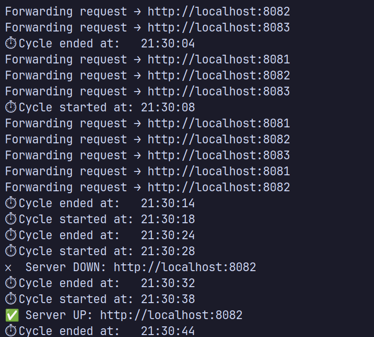

# go-load-balancer

An L7 HTTP load balancer built in Go with round-robin scheduling and active health checks.

## Demo



*Round Robin distribution across three backends, health check cycles every 10 seconds,
automatic failure detection and recovery — demonstrating complete self-healing behavior
without manual intervention.*

## Features

- **Round-robin scheduling** — distributes requests evenly across backends
- **Active health checks** — pings `/health` endpoint every 10 seconds, automatically removes dead servers
- **Automatic recovery** — detects when a backend comes back online and restores it to the pool
- **Thread-safe** — RWMutex allows concurrent reads with exclusive writes for safe concurrent access
- **Timeout handling** — health checks have a 2 second timeout to avoid hanging

## Architecture

```
Client → Load Balancer (:8080) → Backend 1 (:8081)
                               → Backend 2 (:8082)
                               → Backend 3 (:8083)
```

If a backend goes down, all traffic is rerouted to healthy backends automatically.
When it recovers, it rejoins the pool without restarting the balancer.

## Run it

**Start backend servers (separate terminals):**
```bash
go run server.go 8081
go run server.go 8082
go run server.go 8083
```

**Start the load balancer:**
```bash
go run balancer.go
```

**Test round-robin:**
```bash
curl http://localhost:8080
curl http://localhost:8080
curl http://localhost:8080
curl http://localhost:8080
```

Expected output:
```
Hello from backend server on port 8081
Hello from backend server on port 8082
Hello from backend server on port 8083
Hello from backend server on port 8081
```

**Test health checks:**

Stop one backend with `Ctrl+C` — the balancer detects it within 10 seconds:
```
❌ Server DOWN: http://localhost:8082
```

All traffic automatically routes to the remaining healthy backends.
Restart the backend and it rejoins the pool within 10 seconds:
```
✅ Server UP: http://localhost:8082
```

**Test all backends down:**

Stop all three backends — balancer returns HTTP 503:
```
⚠️  All servers are down!
```

Restart any backend and service resumes automatically.

**Test with race detector:**
```bash
go run -race balancer.go
```

No race condition warnings confirms correct concurrent access using RWMutex.

## Built with

- Go 1.26.1
- `net/http` — HTTP server and health check client
- `net/http/httputil` — reverse proxy
- `sync.RWMutex` — concurrent read-safe server state
- `time.NewTicker` — precise fixed-interval health checks
- No external dependencies — standard library only

## Part of

MSc Computer Science Case Study — L7 HTTP Load Balancer
